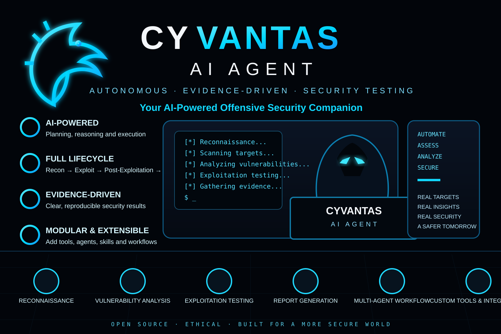

<div align="center">



# CYVANTAS AI AGENT

### Security control plane for evidence-driven AI application security

**50 agents · 26 commands · 19 CLI tools · 11 skills · 2 MCP servers · 7 AI coding tools · 16 bug-bounty platforms · 2,500+ payload lines**

<p>
  
  
  
  
  
  
  
</p>

</div>

---

## ⚡ The idea

Cyvantas is an **evidence-driven application security testing platform** built around AI coding tools.

It keeps the original Pentest Agent Suite capabilities while adding a centralized security control plane for:

- authorization and target scope
- least-privilege execution
- workspace path protection
- secret redaction
- network restrictions
- approval binding
- evidence hashing
- task dependencies
- agent metadata
- budget-aware orchestration

The execution model is deliberately fail-closed:

```text
AI reasoning
     ↓
orchestrator
     ↓
policy / scope
     ↓
least-privilege tool
     ↓
controlled execution
     ↓
evidence
     ↓
validation
     ↓
report
     ↓
human approval
```

> Target content and retrieved documents are treated as **untrusted data** and never as higher-priority instructions.

---

## 🧭 Navigation

- [Quick Start](#-quick-start)
- [Installation & AI Tool Support](#-installation--ai-tool-support)
- [Provider Bundles](#-provider-bundles)
- [Workflow](#-workflow)
- [MCP Servers](#-mcp-servers)
- [Writeup Search & RAG Builder](#-writeup-search--rag-builder)
- [Cost Tracking Hooks](#-cost-tracking-hooks)
- [Commands](#-commands)
- [Agent Fleet](#-agent-fleet)
- [Hunting Skills](#-hunting-skills)
- [CLI Tools](#-cli-tools)
- [Rules Library](#-rules-library)
- [Key Security Features](#-security--orchestration-highlights)
- [Requirements](#-requirements)
- [License](#-license)

---

## 🚀 Quick Start

MCP servers are launched with `uv run --with mcp`; no global pip install is required.

```bash
export HACKERONE_USERNAME=you HACKERONE_TOKEN=your_token

uv run python3 tools/scaffold.py hackerone tesla
cd ~/bounties/hackerone-tesla && claude

/model opus             # Opus 4.7 [1M] — subagents inherit via model: "inherit"
/sync hackerone tesla
/brain init && /status
/hunt tesla.com
```

### What `scaffold.py` provisions

`scaffold.py` provisions a project-scoped workspace for every supported client, not only Claude Code:

```text
CLAUDE.md
AGENTS.md
.codex/
.agents/skills/
.gemini/
.cursor/
.windsurf/
.github/
.vscode/mcp.json
```

The assets are copied into the bounty workspace so path references resolve there.

---

## 🧩 Installation & AI Tool Support

Cyvantas ships pre-rendered for every supported AI coding tool.

### Option A — use the bundles directly

No installation step is required:

```bash
git clone https://github.com/H-mmer/pentest-agents-suite
cd pentest-agents-suite/pentest-agents/providers/codex
codex                       # or: cd ../gemini && gemini, etc.
```

The `providers/<id>/` directory contains a fully translated, ready-to-use bundle for each non-Claude target. Its path references use `..` to reach the repository's `tools/`, `rules/`, and `mcp-*-server/` directories, so the bundle works while it remains inside the cloned repository.

### Option B — install into a project or globally

```bash
python3 -m tools.installer install --targets all --scope project
python3 -m tools.installer install --targets codex --scope global
```

Install mode rewrites paths to absolute references into the cloned pentest-agents repository, so the installation works regardless of where the user's project lives.

### Compatibility matrix

| Target | Agents | Commands | Rules / Instructions | MCP | Scope |
|---|---|---|---|---|---|
| **Claude Code** | native `.claude/agents/*.md` | `.claude/skills/<name>/SKILL.md` | `CLAUDE.md` | `.mcp.json` / `~/.claude.json` | global + project |
| **OpenAI Codex** | `.codex/agents/*.toml` | `.agents/skills/<name>/SKILL.md` | `AGENTS.md` (≤32 KiB) | `[mcp_servers.*]` in `config.toml` | global + project |
| **Google Gemini** | `.gemini/agents/*.md` | TOML in `.gemini/commands/` | `GEMINI.md` | `mcpServers` in `settings.json` | global + project |
| **Cursor** | → skills `.cursor/skills/agent-*/SKILL.md` | → skills `.cursor/skills/cmd-*/SKILL.md` | `.cursor/rules/*.mdc` + `AGENTS.md` | `.cursor/mcp.json` | global + project |
| **Windsurf** | → skills | Workflows | `.windsurf/rules/*.md` (≤12 KiB / file) | `~/.codeium/windsurf/mcp_config.json` | global + project |
| **VS Code Copilot** | `.github/agents/*.agent.md` (≤30 KiB) | `.github/prompts/*.prompt.md` | `.github/copilot-instructions.md` + `.github/instructions/*` | `.vscode/mcp.json` | project + global-MCP |
| **OpenClaw** | → skills | → skills | `~/.openclaw/workspace/AGENTS.md` or `<proj>/AGENTS.md` | `mcp.servers` in `~/.openclaw/openclaw.json` | global + project *(MCP is user-level)* |

Cursor, Windsurf, and OpenClaw have no native subagent concept; Claude-format agents render as skills/rules.

Codex commands are emitted as AgentSkills under `.agents/skills/`; the deprecated `.codex/prompts/` path is not used.

---

## 🛠️ Provider Bundles

```text
providers/
├── codex/    AGENTS.md + .codex/{agents,config.toml} + .agents/skills
├── gemini/   GEMINI.md + .gemini/{agents,commands} + settings.json
├── cursor/   AGENTS.md + .cursor/{rules,skills,mcp.json}
├── windsurf/ AGENTS.md + .windsurf/{rules,workflows,skills} + mcp_config.json
├── copilot/  .github/{copilot-instructions.md,instructions,prompts,agents} + .vscode/mcp.json
└── openclaw/ AGENTS.md + .agents/skills/ + openclaw.json
```

`providers/` is **generated**, not edited by hand.

After changing `.claude/`, `rules/`, or `skills/`, regenerate:

```bash
python3 -m tools.installer render --targets all
python3 -m tools.installer render --check        # exits 1 if drift
```

The `test_committed_providers_match_render` pytest case enforces drift detection locally. There is **no GitHub Actions CI by project policy**.

### Translation rules

When `.claude/` content is rendered for non-Claude targets, the translator:

- drops the `model:` field because each target uses its own default model
- strips Claude-specific prose: `"Claude Code"` → `"the AI coding tool"`
- replaces `"the Agent tool"` → `"the subagent dispatch tool"`
- removes `model: "inherit"`
- rewrites `$CLAUDE_PROJECT_DIR` to `..` in `providers/`, or to absolute paths when installing
- maps `effort:` frontmatter to `model_reasoning_effort` in Codex TOML
- caps Copilot agent bodies at 30,000 characters
- chunks Windsurf rules at 12,000 characters (workspace) / 6,000 characters (global)
- adds Copilot subagent links to orchestrators such as chain-builder, correlator, and recon-ranker

### Installer management

```bash
pentest-agents list
pentest-agents install --targets claude_code,codex --scope global
pentest-agents install --dry-run
pentest-agents verify
pentest-agents uninstall
pentest-agents render --targets all
pentest-agents render --check
```

Every installation records a manifest:

```text
project scope → .pentest-agents/manifest.json
global scope  → ~/.config/pentest-agents/manifest.json
```

Uninstall removes only files Cyvantas wrote and surgically strips only the MCP/JSON keys it merged. Other settings are untouched.

Conflicting files are backed up as:

```text
<path>.pa-backup
```

and restored during uninstall.

---

## 🔄 Workflow

### New target

```text
/new
  ↓
/sync
  ↓
/brain init
  ↓
/analyze
  ↓
/surface
  ↓
/hunt
```

### Returning target

```text
/resume <target>
       ↓
 /hunt  or  /autopilot
```

### Finding lifecycle

```text
/validate
    ↓
 /chain
    ↓
 /report
    ↓
/dupcheck
    ↓
 /submit
    ↓
 /learn
```

### Batch triage

```text
/triage
   ↓
7-Question Gate
   ↓
PASS / KILL / DOWNGRADE / CHAIN REQUIRED
```

---

## 🔌 MCP Servers

Cyvantas ships with **2 MCP servers**.

### 1. `bounty-platforms`

**16 platforms**

- HackerOne — full API
- Bugcrowd
- Intigriti
- Immunefi — public
- YesWeHack
- 11 additional stubs

**7 MCP tools**

```text
list_platforms
get_program_scope
get_program_policy
search_hacktivity
sync_program
draft_report
submit_report
```

### 2. `writeup-search`

A searchable knowledge base that agents can query during hunting and validation.

**4 MCP tools**

| Tool | Role |
|---|---|
| `search_writeups` | Semantic FAISS search or keyword search for prior art |
| `get_writeup` | Retrieve complete writeup content by ID |
| `search_techniques` | Search exploitation techniques by vulnerability class |
| `search_payloads` | Search curated payloads from `rules/payloads.md` |

> **The writeup index is not bundled.** Bulk redistribution of scraped hacktivity can violate platform ToS. The repository ships the server instead. `search_payloads` and `search_techniques` work immediately; semantic/keyword layers activate after you provide your own index.

---

## 🧠 Writeup Search Modes

The server automatically detects the strongest available mode and falls back gracefully.

| Mode | Requires | Searches |
|---|---|---|
| **FAISS** | `faiss-cpu`, `sentence-transformers`, your `metadata.db` + `index.faiss` | Your writeup corpus using vector embeddings |
| **SQLite** | Your `metadata.db` | Your writeup corpus using `LIKE` over the text column |
| **Local** | Nothing | `rules/payloads.md` + shipped `skills/` |

Point the server at your index by placing:

```text
metadata.db
index.faiss   # optional outside local/SQLite mode
```

in:

```text
~/.local/share/pentest-writeups/
```

or set:

```bash
export WRITEUP_DB_DIR=/path/to/dir
```

### Expected `metadata.db` schema

The SQLite database needs at least one table containing:

```text
id
title
url
content / text / body / writeup
```

When semantic mode is used, row order in the table must match vector order in `index.faiss`.

---

## 🏗️ Build Your Own Writeup Index

The repository includes a local RAG/FAISS builder in:

```text
rag-builder/
```

It converts a list of GitHub / GitLab repositories into:

```text
metadata.db
index.faiss
```

Destructive operations such as clone, embed, and write are **always gated behind `--execute`**.

Without `--execute`, the CLI only prints the plan and changes nothing.

### Build sequence

```bash
cd rag-builder

# 1. Inspect the plan — no network, no writes.
python3 build.py status
python3 build.py ingest

# 2. Optional pre-flight: probe every URL with git ls-remote.
python3 build.py ingest --check-remotes

# 3. Actually clone + index every repo from repos.yaml into ./data/.
python3 build.py ingest --execute
python3 build.py ingest --execute --check-remotes

# 4. Point the MCP server at the output.
export WRITEUP_DB_DIR="$PWD/data"
python3 ../mcp-writeup-server/server.py --test
```

`rag-builder/repos.yaml` ships with a **146-entry seed** covering CTF archives, bug-bounty reports, payload collections, and research aggregators.

- edit the seed freely
- `repos-skipped.yaml` is loaded automatically as an exclusion list
- override with `--skip-list` or `--no-skip-list`
- `config.yaml` controls the embedding model, host allowlist, clone size cap, and file-size ceiling
- default embedding model: `all-MiniLM-L6-v2`

See `rag-builder/README.md` for the full reference.

---

## 💰 Cost Tracking Hooks

Configured in `settings.json` and fired automatically:

| Hook | Action |
|---|---|
| `SubagentStop` | `cost_hook.py` logs agent name + session to `cost-tracking.json` |
| `Stop` | Logs session end |
| `SessionStart` | Shows welcome message |

The statusline exposes live session cost from token data, for example:

```text
$0.57
```

---

## 🎛️ Commands

Cyvantas exposes **26 commands** grouped by job.

### Hunting & Analysis

| Command | What it does |
|---|---|
| `/hunt <target> [--vuln-class]` | Active hunting — searches writeup DB for techniques first, then tests concrete payloads |
| `/autopilot <target>` | Autonomous loop with `--paranoid` / `--normal` / `--yolo` checkpoints |
| `/surface <target>` | P1 / P2 / Kill attack-surface ranking |
| `/chain` | Builds A→B→C exploit chains using the chain-builder agent; capability table has 9 rows + 4 documented deep chains |
| `/analyze <target>` | AI analysis of crown jewels, attack paths, and blind spots |
| `/mindmap <target>` | Attack-surface tree with brain status |
| `/sast <repo>` | Source-code vulnerability hunting: entry → flow → gap → exploit |

### Validation & Reporting

| Command | What it does |
|---|---|
| `/validate <finding>` | 7-Question Gate → PASS / KILL / DOWNGRADE / CHAIN REQUIRED |
| `/triage` | Batch-validates all findings and kills weak ones |
| `/quality <draft>` | Scores a report 1–10 and blocks scores below 7 |
| `/report [format]` | Generates reports; hard gate requires `/validate PASS` |
| `/dupcheck <desc>` | Checks Hacktivity + writeup DB for duplicates |
| `/submit <finding>` | Submission requires `/validate PASS` + `/quality ≥ 7` |

### Session & Memory

| Command | What it does |
|---|---|
| `/resume <target>` | Resumes with untested endpoints + suggestions |
| `/remember` | Logs a finding/pattern for cross-target learning |
| `/learn <id> <status>` | Records response and auto-boosts paid techniques |
| `/brain` | `init`, `brief`, `status`, `endpoint`, `endpoints`, `record`, `exhausted` |

### Infrastructure

| Command | What it does |
|---|---|
| `/new`, `/sync`, `/status` | Setup + dashboard |
| `/pipeline`, `/quickscan`, `/fullscan` | Scanning pipelines |
| `/correlate` | Chain discovery across findings |
| `/cost`, `/monitor` | Cost tracking + target change detection |

---

## 🤖 Agent Fleet

**50 agents** organized around hunting, validation, orchestration, recon, SAST, and specialized security work.

### H1 Weakness Specialists — 19

```text
xss-hunter (#60/#61/#62)
sqli-hunter (#67)
csrf-hunter (#57)
ssrf-hunter (#75)
ssti-hunter (#74)
idor-hunter (#55)
auth-tester (#27)
info-disclosure (#18)
open-redirect (#38)
rce-hunter (#70)
xxe-hunter (#63)
file-upload (#39)
cors-hunter (#58)
subdomain-takeover (#145)
business-logic (#28)
race-condition (#29)
privilege-escalation (#26)
oauth-hunter (#1/#22/#106/#137)
llm-ai-hunter (chains under #18/#55/#61/#70/#106)
```

### Hunting & Analysis — 3

- **validator** — 7-Question Gate + never-submit list
- **chain-builder** — A→B chain walk against the capability table; searches the writeup DB for proven chains
- **recon-ranker** — P1 / P2 / Kill surface ranking

### Infrastructure / Recon — 10

```text
recon
vuln-scanner
config-auditor
cloud-recon
js-analyzer
waf-profiler
graphql-audit
nuclei-writer
browser-agent       (Burp MCP)
browser-stealth-agent (Camoufox)
```

### Meta / Validation — 9

```text
brain
correlator
quality-check
monitor
poc-builder
report-writer
scope-check
browser-verifier       (client-side PoC proof)
dast-devils-advocate   (adversarial downgrade)
```

### SAST Pipeline — 8

```text
sast-file-ranker
sast-entry-mapper
sast-danger-mapper
sast-flow-tracer
sast-gap-analyzer
sast-devils-advocate
sast-hunter
sast-exploit-builder
```

### Specialized — 1

**web3-auditor**

- Solidity grep arsenal
- Foundry PoC
- DeFi patterns

---

## 🧪 Hunting Skills

**5 deep methodology skills + 6 reference skills = 11 skills**

The `hunt-*` skills are vulnerability-class-specific methodology files distilled from public bug-bounty reports.

Each includes a verified **2024–2026 CVE catalog** and sub-techniques.

The matching specialist agent reads:

```text
Read $CLAUDE_PROJECT_DIR/skills/hunt-<class>/SKILL.md
```

before testing.

| Skill | Lines | Paired agent | Highlights |
|---|---:|---|---|
| `skills/hunt-rce/SKILL.md` | 1,135 | `rce-hunter` | 1,218-report distillation; RSC CVE-2025-55182, runc Leaky Vessels, BentoML pickle, LangChain REPL, Tekton/OpenProject git arg injection, ingress-nginx, container/runtime, ML serving, agentic LLM tool-use, OSS supply chain |
| `skills/hunt-idor/SKILL.md` | 969 | `idor-hunter` | 1,117-report distillation; Sam Curry automotive chain, OneUptime CVE-2026-30956, Zitadel V2Beta/Mgmt API, Inforcer tenant enum, Apache Answer UUIDv1 prediction, Indico BOLA, GraphQL field-level pivots, agentic AI cross-tenant |
| `skills/hunt-xss/SKILL.md` | 968 | `xss-hunter` | DOMPurify mXSS family, Auth0 nextjs-auth0 returnTo, RSC DoS family, markdown-to-jsx, listmonk admin-ATO, Trix rich-text editor (H1 #2819573 / #2521419), Jupyter notebook XSS (GHSA-rch3-82jr-f9w9), n8n MCP OAuth XSS (GHSA-537j-gqpc-p7fq), LinkedIn-class iframe-in-article (H1 #2212950), 10 sub-techniques (A–J), Semgrep / ast-grep / ripgrep / CodeQL patterns |
| `skills/hunt-oauth/SKILL.md` | 770 | `oauth-hunter` | 365-report distillation; ruby-saml parser differentials, Authentik regex `redirect_uri`, workers-oauth-provider PKCE downgrade, Entra ID actor token, Hono JWT alg confusion, nOAuth, Tekton token exfil, Argo CD project token, tinyauth |
| `skills/hunt-llm-ai/SKILL.md` | 930 | `llm-ai-hunter` | OWASP LLM Top 10 v2025 + Agentic AI Top 10; Microsoft 365 Copilot ASCII Smuggling, LangChain GmailToolkit indirect injection (CVE-2025-46059), LangChain PythonREPLTool semantic RCE (CVE-2025-68613), BentoML pickle, Ollama RCE family, Open WebUI SSE injection, MLflow path traversal |

### Reference skills

```text
hunting-methodology
recon-methodology
report-writing
sast-methodology
triage-validation
vuln-classes
```

---

## 🧰 CLI Tools

**19 tools** form the local security and orchestration layer.

| Tool | Purpose |
|---|---|
| `brain.py` | Brain with endpoint tracking + circuit breaker |
| `intel_engine.py` | Hacktivity patterns + technology→vulnerability mapping |
| `journal.py` | JSONL session journal for `/resume` |
| `target_selector.py` | Program ROI ranking |
| `cost_hook.py` | CC hook: auto-logs agent completions via `SubagentStop` |
| `statusline.py` | Dashboard with `--compact` / `--watch` / `--json` |
| `scope_check.py` | Scope validation with `--list` |
| `scope_hook.py` | PreToolUse hook that blocks out-of-scope Bash commands using exact + wildcard matching |
| `cvss_version_guard.py` | Enforces H1 = CVSS 3.1; other platforms = CVSS 4.0 |
| `file_path_guard.py` | Blocks hallucinated file paths in reports |
| `file_safety.py` | Shared safety checks for agent-written files |
| `dedup_findings.py` | Deduplication + Hacktivity cross-reference |
| `global_brain.py` | Cross-engagement knowledge with incremental hash-based sync |
| `response_tracker.py` | Response learning + automatic paid-technique boosting |
| `scaffold.py` | Workspace scaffolding with update mode |
| `capture.py` | Screenshots + video (WSL2) |
| `cost.py` | Token cost tracking + ROI |
| `camofox_ctl.sh` | Camoufox / stealth Firefox lifecycle — Cloudflare/Akamai bypass |
| `pentest-statusline.sh` | Claude Code statusline: findings, brain, context, cost |

---

## 📚 Rules Library

`rules/` is the **single source of truth** for agents. Hunters, validators, and report-writers read relevant rule files at session start.

| File | Lines | Purpose |
|---|---:|---|
| `hunting.md` | 360 | 31 hunting rules: Rule 0 harm check, Rule 8 sibling check, Rule 9 A→B signal, Rule 19 never-submit, Rule 24 mutation matrix, Rule 28 detection-token rotation, Rule 30 no cross-region inference, Rule 31 unauth state-change battery |
| `payloads.md` | 2,605 | XSS incl. Detection Mechanism Rotation Ladder, SSRF, SQLi, IDOR, OAuth, upload, race, SSTI, deserialization, JWT, LFI, prototype pollution, NoSQLi, DeFi |
| `techniques.md` | 389 | Proven attack techniques extracted from real paid engagements |
| `waf-bypass-protocol.md` | 166 | WAF bypass iteration ladder for Akamai / Cloudflare / Imperva |
| `vendor-status.md` | 127 | Patched vendor vectors, framework fingerprints, cooldown tables |
| `chain-table.md` | 192 | Capability→next-bug chain table for `/chain`: 9 capability rows + 4 documented deep chains |
| `never-submit.md` | 42 | Never-submit list + conditionally-valid-with-chain table |
| `mistakes.md` | 665 | Top 10 most common mistakes — every agent reads this at session start |

---

## 🛡️ Security & Orchestration Highlights

| Capability | What it enforces |
|---|---|
| **Writeup Search MCP** | Prior-art lookup using your FAISS/SQLite index, with shipped payload/technique fallback |
| **CC Hooks** | `SubagentStop` / `Stop` cost logging + live statusline |
| **PreToolUse Scope Hook** | Exact + wildcard matching against `scope.yaml`; blocks out-of-scope Bash before execution |
| **7-Question Gate** | Every finding is validated; first `NO` = `KILL` |
| **Depth Engine** | `/autopilot` prevents shallow "exhausted" claims until the exhaustion matrix is complete |
| **Stacked-Encoding Mandate** | `/hunt` and `/autopilot` require multi-layer encoding in every payload attempt before declaring a surface clean |
| **CVSS Policy Guard** | HackerOne → CVSS 3.1; every other platform → CVSS 4.0 |
| **Circuit Breaker** | 5× consecutive 403/429 → automatic 60-second backoff |
| **Endpoint Tracking** | Brain records every tested endpoint per target |
| **Hard Validation Gates** | `/report` and `/submit` refuse without `/validate PASS` |
| **Never-Submit Filter** | Informational findings are automatically killed |
| **Incremental Sync** | Global brain uses hashes and skips unchanged files |
| **Feedback Loop** | `/learn` automatically boosts paid techniques globally |
| **Session Journal** | JSONL logging preserves `/resume` continuity |

---

## 📊 Project at a glance

```text
~760 files
~118k lines
50 agents
26 commands
19 CLI tools
11 skills
2 MCP servers
16 bug-bounty platforms
7 AI coding tools
2,500 payload lines
```

### The architecture in one sentence

> **AI reasoning → centralized policy → controlled tools → evidence → validation → report → human approval.**

---

## ⚙️ Requirements

### Core

- Python 3.10+
- `uv` — MCP servers launch via `uv run --with mcp`

### Optional semantic search

```bash
uv pip install faiss-cpu sentence-transformers
```

### Security tooling

```text
nmap
httpx
subfinder
nuclei
ffuf
katana
sqlmap
```

### GraphQL

```text
graphql-path-enum
```

Install:

```bash
cargo install --git https://gitlab.com/dee-see/graphql-path-enum
```

`setup-mcp.sh` auto-installs it when `cargo` is available.

### Evidence

```text
grim / scrot
wf-recorder / ffmpeg
```

### Statusline

```text
jq
```

---

## 🔐 Authorization

Cyvantas is designed for **authorized security testing only**.

Use it only against assets and programs for which you have explicit permission, follow the applicable program rules, and practice responsible disclosure.

---

## 📄 License

For authorized security testing only. Follow responsible disclosure.
